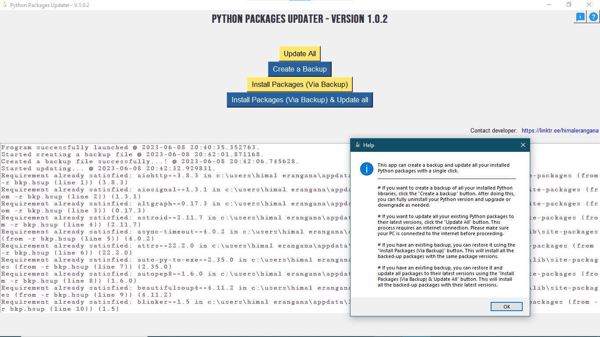

# Python Package Upgrader 🐍

Python Package Upgrader is a simple GUI app that makes it easy to update and backup your installed Python packages. With a single click, users can create a backup and update all installed Python packages. This simplifies the process of keeping libraries up to date.

The app is intended for anyone who uses Python and wants an easy way to manage their libraries. It is super simple to use, so try it now! All are welcome to make suggestions and contribute code.

## Features 🚀

- Create a backup of all installed Python libraries 💾
- Update all existing Python packages to their latest versions 🆕
- Restore packages from a backup 🔙
- Simple and easy-to-use interface 👌

## Installation 💻

To install Python Package Upgrader, go to the [releases page](https://github.com/HimalEranganaOfficial/Python-Package-Upgrader/releases) and download the latest version. Follow the instructions for your platform to install and run the app.

## Usage 📖

To use Python Package Upgrader, simply launch the app and follow the on-screen instructions. You can create a backup of your installed libraries, update them to their latest versions, or restore them from a backup.

## Contributing 💡

If you would like to contribute to the development of Python Package Upgrader, please [open an issue](https://github.com/HimalEranganaOfficial/Python-Package-Upgrader/issues) or [submit a pull request](https://github.com/HimalEranganaOfficial/Python-Package-Upgrader/pulls). We welcome contributions of all kinds!

## License ⚖️

Python Package Upgrader is licensed under the [MIT License](LICENSE).
